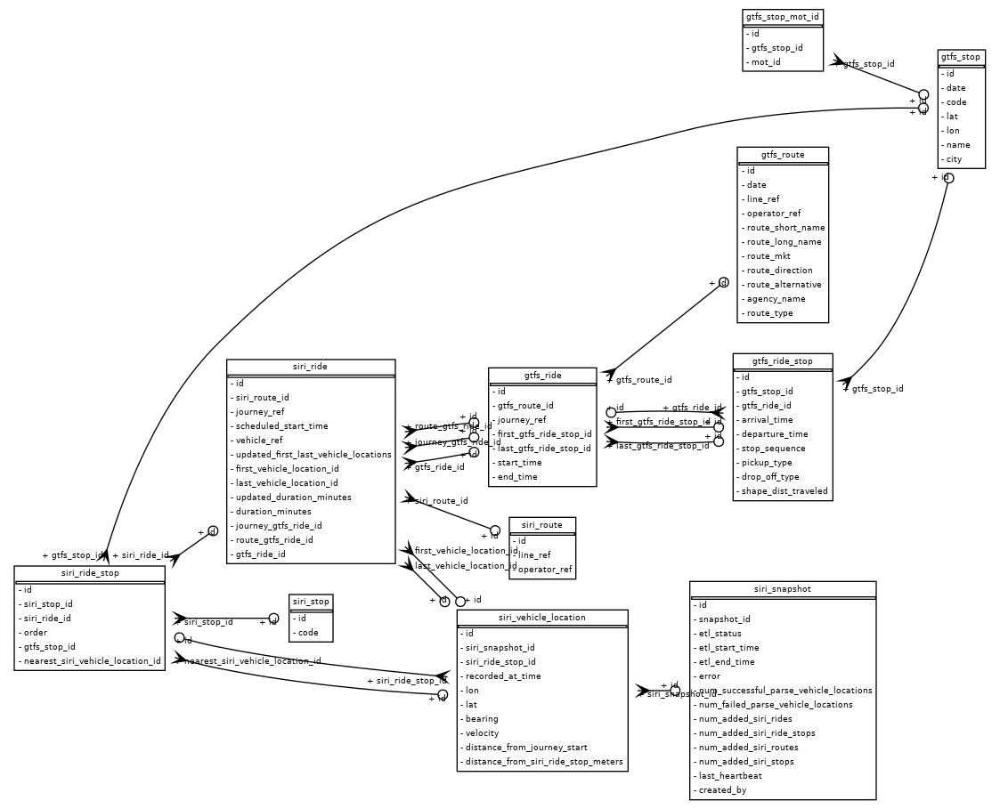

# Open Bus Stride Data Model

## artifact

Static files from ETL / processing tasks stored in S3.

#### artifact.id

#### artifact.file_prefix

#### artifact.status

#### artifact.metadata_json

#### artifact.error

#### artifact.url

#### artifact.created_at

#### artifact.file_size_bytes

## gtfs_route

A planned route. 
Populated daily from the MOT GTFS data by [gtfs-etl](https://github.com/hasadna/open-bus-pipelines/blob/main/STRIDE_ETL_PROCESSES.md#gtfs-etl).

#### gtfs_route.id

#### gtfs_route.date

Because the GTFS data may change daily, each route is only relevant for a single day specified in this field.

#### gtfs_route.line_ref

Unique identifier for this route, together with [operator_ref](https://github.com/hasadna/open-bus-stride-db/blob/main/DATA_MODEL.md#gtfs_routeoperator_ref).

#### gtfs_route.operator_ref

Unique identifier for this route, together with [line_ref](https://github.com/hasadna/open-bus-stride-db/blob/main/DATA_MODEL.md#gtfs_routeline_ref).

#### gtfs_route.route_short_name

#### gtfs_route.route_long_name

#### gtfs_route.route_mkt

#### gtfs_route.route_direction

#### gtfs_route.route_alternative

#### gtfs_route.agency_name

#### gtfs_route.route_type

## gtfs_stop

A single stop. 
Populated daily from the MOT GTFS data by [gtfs-etl](https://github.com/hasadna/open-bus-pipelines/blob/main/STRIDE_ETL_PROCESSES.md#gtfs-etl).

#### gtfs_stop.id

#### gtfs_stop.date

Because the GTFS data may change daily, each stop is relevant only for a single day specified in this field.

#### gtfs_stop.code

The GTFS stop code.

#### gtfs_stop.lat

#### gtfs_stop.lon

#### gtfs_stop.name

#### gtfs_stop.city

## gtfs_stop_mot_id

Each [gtfs_stop](https://github.com/hasadna/open-bus-stride-db/blob/main/DATA_MODEL.md#gtfs_stop) can have multiple MOT identifiers, represented in this table.
Populated daily from the MOT GTFS data by [gtfs-etl](https://github.com/hasadna/open-bus-pipelines/blob/main/STRIDE_ETL_PROCESSES.md#gtfs-etl).

#### gtfs_stop_mot_id.id

#### gtfs_stop_mot_id.gtfs_stop_id

#### gtfs_stop_mot_id.mot_id

## gtfs_ride

A planned ride (AKA trip) along a specified route. 
Populated daily from the MOT GTFS data by [gtfs-etl](https://github.com/hasadna/open-bus-pipelines/blob/main/STRIDE_ETL_PROCESSES.md#gtfs-etl).

#### gtfs_ride.id

#### gtfs_ride.gtfs_route_id

The related [gtfs_route](https://github.com/hasadna/open-bus-stride-db/blob/main/DATA_MODEL.md#gtfs_route) this ride is a part of.

#### gtfs_ride.journey_ref

A unique identifier for this ride as provided by the original MOT GTFS data.

#### gtfs_ride.first_gtfs_ride_stop_id

The first [gtfs_ride_stop](https://github.com/hasadna/open-bus-stride-db/blob/main/DATA_MODEL.md#gtfs_ride_stop) along this ride. 
Populated from [stride-etl-gtfs-update-ride-aggregations](https://github.com/hasadna/open-bus-pipelines/blob/main/STRIDE_ETL_PROCESSES.md#stride-etl-gtfs-update-ride-aggregations).

#### gtfs_ride.last_gtfs_ride_stop_id

The last [gtfs_ride_stop](https://github.com/hasadna/open-bus-stride-db/blob/main/DATA_MODEL.md#gtfs_ride_stop) along this ride. 
Populated from [stride-etl-gtfs-update-ride-aggregations](https://github.com/hasadna/open-bus-pipelines/blob/main/STRIDE_ETL_PROCESSES.md#stride-etl-gtfs-update-ride-aggregations).

#### gtfs_ride.start_time

The start time of this ride. 
Populated from [stride-etl-gtfs-update-ride-aggregations](https://github.com/hasadna/open-bus-pipelines/blob/main/STRIDE_ETL_PROCESSES.md#stride-etl-gtfs-update-ride-aggregations).

#### gtfs_ride.end_time

The end time of this ride. 
Populated from [stride-etl-gtfs-update-ride-aggregations](https://github.com/hasadna/open-bus-pipelines/blob/main/STRIDE_ETL_PROCESSES.md#stride-etl-gtfs-update-ride-aggregations).

## gtfs_ride_stop

A planned stop along a [gtfs_ride](https://github.com/hasadna/open-bus-stride-db/blob/main/DATA_MODEL.md#gtfs_ride). 
Populated daily from the MOT GTFS data by [gtfs-etl](https://github.com/hasadna/open-bus-pipelines/blob/main/STRIDE_ETL_PROCESSES.md#gtfs-etl).

#### gtfs_ride_stop.id

#### gtfs_ride_stop.gtfs_stop_id

The related [gtfs_stop](https://github.com/hasadna/open-bus-stride-db/blob/main/DATA_MODEL.md#gtfs_stop).

#### gtfs_ride_stop.gtfs_ride_id

The related [gtfs_ride](https://github.com/hasadna/open-bus-stride-db/blob/main/DATA_MODEL.md#gtfs_ride).

#### gtfs_ride_stop.arrival_time

#### gtfs_ride_stop.departure_time

#### gtfs_ride_stop.stop_sequence

#### gtfs_ride_stop.pickup_type

#### gtfs_ride_stop.drop_off_type

#### gtfs_ride_stop.shape_dist_traveled

## siri_ride

A ride along a [siri_route](https://github.com/hasadna/open-bus-stride-db/blob/main/DATA_MODEL.md#siri_route). 
Populated in near real time from the SIRI data by [siri-etl-process-snapshot-new-snapshots-daemon](https://github.com/hasadna/open-bus-pipelines/blob/main/STRIDE_ETL_PROCESSES.md#siri-etl-process-snapshot-new-snapshots-daemon).

#### siri_ride.id

#### siri_ride.siri_route_id

The related [siri_route](https://github.com/hasadna/open-bus-stride-db/blob/main/DATA_MODEL.md#siri_route).

#### siri_ride.journey_ref

A unique identifier for this ride as provided by the SIRI data.

#### siri_ride.scheduled_start_time

The scheduled start time as provided by the SIRI data.
Note that this value may change over time but we only show the first
value as received from the SIRI real-time data.
See [this issue](https://github.com/hasadna/open-bus/issues/390) for more details.

#### siri_ride.vehicle_ref

A unique identifier of the bus or vehicle.
This may be the license number but could 
also be other identifier as provided by the SIRI data.

#### siri_ride.first_vehicle_location_id

The first [siri_vehicle_location](https://github.com/hasadna/open-bus-stride-db/blob/main/DATA_MODEL.md#siri_vehicle_location) along this ride.
Populated by [stride-etl-siri-add-ride-durations](https://github.com/hasadna/open-bus-pipelines/blob/main/STRIDE_ETL_PROCESSES.md#stride-etl-siri-add-ride-durations).

#### siri_ride.last_vehicle_location_id

The last [siri_vehicle_location](https://github.com/hasadna/open-bus-stride-db/blob/main/DATA_MODEL.md#siri_vehicle_location) along this ride.
Populated by [stride-etl-siri-add-ride-durations](https://github.com/hasadna/open-bus-pipelines/blob/main/STRIDE_ETL_PROCESSES.md#stride-etl-siri-add-ride-durations).

#### siri_ride.duration_minutes

The duration of this ride in minutes.
Populated by [stride-etl-siri-add-ride-durations](https://github.com/hasadna/open-bus-pipelines/blob/main/STRIDE_ETL_PROCESSES.md#stride-etl-siri-add-ride-durations).

#### siri_ride.journey_gtfs_ride_id

The related [gtfs_ride](https://github.com/hasadna/open-bus-stride-db/blob/main/DATA_MODEL.md#gtfs_ride) based on journey_ref.
Populated by [stride-etl-siri-update-rides-gtfs](https://github.com/hasadna/open-bus-pipelines/blob/main/STRIDE_ETL_PROCESSES.md#stride-etl-siri-update-rides-gtfs).

#### siri_ride.route_gtfs_ride_id

The related [gtfs_ride](https://github.com/hasadna/open-bus-stride-db/blob/main/DATA_MODEL.md#gtfs_ride) based on operator_ref, line_ref and scheduled_start_time.
Populated by [stride-etl-siri-update-rides-gtfs](https://github.com/hasadna/open-bus-pipelines/blob/main/STRIDE_ETL_PROCESSES.md#stride-etl-siri-update-rides-gtfs).

#### siri_ride.gtfs_ride_id

The related [gtfs_ride](https://github.com/hasadna/open-bus-stride-db/blob/main/DATA_MODEL.md#gtfs_ride) based on best match from either [journey_gtfs_ride_id](https://github.com/hasadna/open-bus-stride-db/blob/main/DATA_MODEL.md#siri_ridejourney_gtfs_ride_id) or [route_gtfs_ride_id](https://github.com/hasadna/open-bus-stride-db/blob/main/DATA_MODEL.md#siri_rideroute_gtfs_ride_id).
Populated by [stride-etl-siri-update-rides-gtfs](https://github.com/hasadna/open-bus-pipelines/blob/main/STRIDE_ETL_PROCESSES.md#stride-etl-siri-update-rides-gtfs).

## siri_ride_stop

A [siri_stop](https://github.com/hasadna/open-bus-stride-db/blob/main/DATA_MODEL.md#siri_stop) along a specified [siri_ride](https://github.com/hasadna/open-bus-stride-db/blob/main/DATA_MODEL.md#siri_ride).
Populated in near real time from the SIRI data by [siri-etl-process-snapshot-new-snapshots-daemon](https://github.com/hasadna/open-bus-pipelines/blob/main/STRIDE_ETL_PROCESSES.md#siri-etl-process-snapshot-new-snapshots-daemon).

#### siri_ride_stop.id

#### siri_ride_stop.siri_stop_id

The related [siri_stop](https://github.com/hasadna/open-bus-stride-db/blob/main/DATA_MODEL.md#siri_stop).

#### siri_ride_stop.siri_ride_id

The related [siri_ride](https://github.com/hasadna/open-bus-stride-db/blob/main/DATA_MODEL.md#siri_ride).

#### siri_ride_stop.order

The order of this stop along the ride, first stop is 0.

#### siri_ride_stop.gtfs_stop_id

The related [gtfs_stop](https://github.com/hasadna/open-bus-stride-db/blob/main/DATA_MODEL.md#gtfs_stop). Populated via [stride-etl-siri-update-ride-stops-gtfs](https://github.com/hasadna/open-bus-pipelines/blob/main/STRIDE_ETL_PROCESSES.md#stride-etl-siri-update-ride-stops-gtfs).

#### siri_ride_stop.nearest_siri_vehicle_location_id

The siri vehicle location from this ride which is nearest to 
the [gtfs_stop.lon](https://github.com/hasadna/open-bus-stride-db/blob/main/DATA_MODEL.md#gtfs_stoplon) / [gtfs_stop.lat](https://github.com/hasadna/open-bus-stride-db/blob/main/DATA_MODEL.md#gtfs_stoplat).
Populated via [stride-etl-siri-update-ride-stops-vehicle-locations](https://github.com/hasadna/open-bus-pipelines/blob/main/STRIDE_ETL_PROCESSES.md#stride-etl-siri-update-ride-stops-vehicle-locations).

## siri_route

A SIRI route, populated in near real time from the SIRI data by [siri-etl-process-snapshot-new-snapshots-daemon](https://github.com/hasadna/open-bus-pipelines/blob/main/STRIDE_ETL_PROCESSES.md#siri-etl-process-snapshot-new-snapshots-daemon).
Multiple rides can occur on a route, these are available in [siri_ride](https://github.com/hasadna/open-bus-stride-db/blob/main/DATA_MODEL.md#siri_ride)
and related by [siri_ride.siri_route_id](https://github.com/hasadna/open-bus-stride-db/blob/main/DATA_MODEL.md#siri_ridesiri_route_id).

#### siri_route.id

#### siri_route.line_ref

In combination with the [operator_ref](https://github.com/hasadna/open-bus-stride-db/blob/main/DATA_MODEL.md#siri_routeoperator_ref) - uniquely identifies the route and relates to the GTFS identifiers

#### siri_route.operator_ref

In combination with the [line_ref](https://github.com/hasadna/open-bus-stride-db/blob/main/DATA_MODEL.md#siri_routeline_ref) - uniquely identifies the route and relates to the GTFS identifiers

## siri_stop

A SIRI stop, populated in near real time from the SIRI data by [siri-etl-process-snapshot-new-snapshots-daemon](https://github.com/hasadna/open-bus-pipelines/blob/main/STRIDE_ETL_PROCESSES.md#siri-etl-process-snapshot-new-snapshots-daemon).

#### siri_stop.id

#### siri_stop.code

Corresponds to the GTFS stop code, as received from the SIRI data.

## siri_vehicle_location

A vehicle location, accurate to within 1 minute, populated in near real time from the SIRI data by [siri-etl-process-snapshot-new-snapshots-daemon](https://github.com/hasadna/open-bus-pipelines/blob/main/STRIDE_ETL_PROCESSES.md#siri-etl-process-snapshot-new-snapshots-daemon).

#### siri_vehicle_location.id

#### siri_vehicle_location.siri_snapshot_id

The [siri_snapshot](https://github.com/hasadna/open-bus-stride-db/blob/main/DATA_MODEL.md#siri_snapshot) which contained this vehicle location.

#### siri_vehicle_location.siri_ride_stop_id

The [siri_ride_stop](https://github.com/hasadna/open-bus-stride-db/blob/main/DATA_MODEL.md#siri_ride_stop) which is nearest to this vehicle location.
This relation can be used to get all relevant details like route / ride / stop relating to this location.

#### siri_vehicle_location.recorded_at_time

The date/time when this location was recorded according to the MOT SIRI data.

#### siri_vehicle_location.lon

The geographical lon of this vehicle at the recorded time, according to the MOT SIRI data.

#### siri_vehicle_location.lat

The geographical lat of this vehicle at the recorded time, according to the MOT SIRI data.

#### siri_vehicle_location.bearing

The bearing of this vehicle at the recorded time, according to the MOT SIRI data.

#### siri_vehicle_location.velocity

The velocity of this vehicle at the recorded time, according to the MOT SIRI data.

#### siri_vehicle_location.distance_from_journey_start

The distance from journey start of this vehicle at the recorded time, according to the MOT SIRI data.

#### siri_vehicle_location.distance_from_siri_ride_stop_meters

Distance from the nearest [siri_ride_stop](https://github.com/hasadna/open-bus-stride-db/blob/main/DATA_MODEL.md#siri_ride_stop) according to the GTFS stop location.
Populated via [stride-etl-siri-update-ride-stops-vehicle-locations](https://github.com/hasadna/open-bus-pipelines/blob/main/STRIDE_ETL_PROCESSES.md#stride-etl-siri-update-ride-stops-vehicle-locations).

## siri_snapshot

A SIRI Snapshot which was received from MOT. 
We get a new snapshot every 1 minute via [siri-etl-process-snapshot-new-snapshots-daemon](https://github.com/hasadna/open-bus-pipelines/blob/main/STRIDE_ETL_PROCESSES.md#siri-etl-process-snapshot-new-snapshots-daemon)

#### siri_snapshot.id

#### siri_snapshot.snapshot_id

A string which uniquely identifies the snapshot and the date/time when it was taken.
Uses the following format: year/month/day/hours/minutes (e.g. 2022/03/09/11/08).

#### siri_snapshot.etl_status

Describes the ETL status of this snapshot, 
only snapshots with status "loaded" should be considered ready for usage.

#### siri_snapshot.etl_start_time

#### siri_snapshot.etl_end_time

#### siri_snapshot.error

If the ETL processing failed for this snapshot, will contain the error message.

#### siri_snapshot.num_successful_parse_vehicle_locations

Number of [siri_vehicle_location](https://github.com/hasadna/open-bus-stride-db/blob/main/DATA_MODEL.md#siri_vehicle_location)s which were successfully parsed from this SIRI snapshot.

#### siri_snapshot.num_failed_parse_vehicle_locations

Number of [siri_vehicle_location](https://github.com/hasadna/open-bus-stride-db/blob/main/DATA_MODEL.md#siri_vehicle_location)s which failed to be parsed from this SIRI snapshot.

#### siri_snapshot.num_added_siri_rides

Number of new [siri_ride](https://github.com/hasadna/open-bus-stride-db/blob/main/DATA_MODEL.md#siri_ride)s which were added as a result of processing this SIRI snapshot.

#### siri_snapshot.num_added_siri_ride_stops

Number of new [siri_ride_stop](https://github.com/hasadna/open-bus-stride-db/blob/main/DATA_MODEL.md#siri_ride_stop)s which were added as a result of processing this SIRI snapshot.

#### siri_snapshot.num_added_siri_routes

Number of new [siri_route](https://github.com/hasadna/open-bus-stride-db/blob/main/DATA_MODEL.md#siri_route)s which were added as a result of processing this SIRI snapshot.

#### siri_snapshot.num_added_siri_stops

Number of new [siri_stop](https://github.com/hasadna/open-bus-stride-db/blob/main/DATA_MODEL.md#siri_stop)s which were added as a result of processing this SIRI snapshot.

